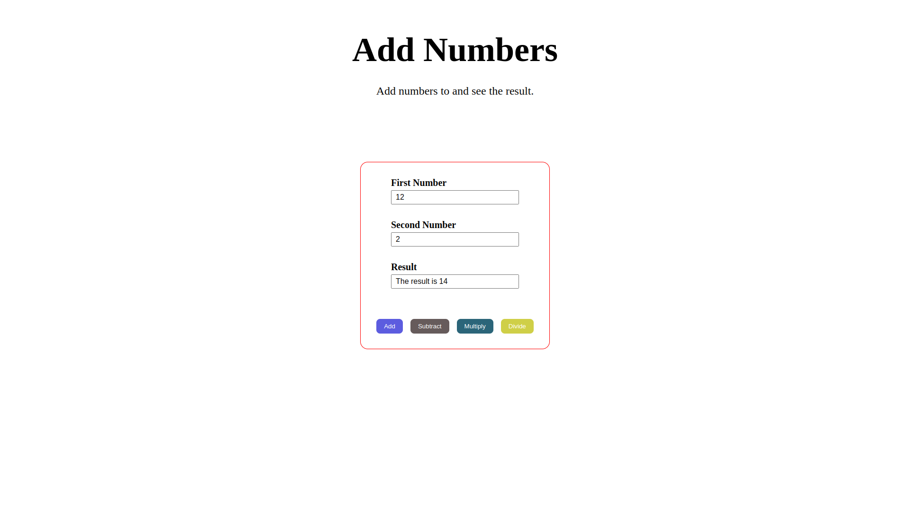

# [AddNumJS](https://github.com/rahulrajdahal/AddNum-js). Add any two numbers and view the Results

Add two numbers and instantly get the results.

## Preview

[](https://github.com/rahulrajdahal/AddNum-js)

## 🏗 Development Guide

### 1. Clone the repository

```sh
git clone https://github.com/rahulrajdahal/AddNum-js.git
```

### 2. Open the project

```sh
open index.html in your browser
```

## 🚀 Project Structure

Inside project [AddNumJS](https://github.com/rahulrajdahal/AddNum-js), you'll see the following folders and files:

```text
/
├── app.js
├── styles.css
└── index.html
```
